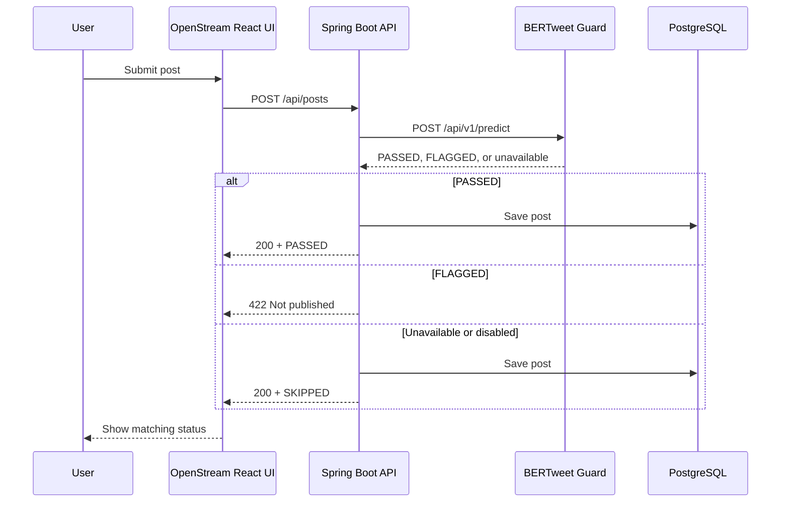

# OpenStream

Frontend for **OpenStream**, a public microblogging platform with moderation-aware posting. The React single-page application provides feed, search, profile, and follow experiences and communicates the state of server-side BERTweet verification before each new post is published.

**Live application:** [openstream.anutej.us](https://openstream.anutej.us/)  
**Backend repository:** [anutej-kardele/openstream-api](https://github.com/anutej-kardele/openstream-api)  
**Moderation service:** [anutej-kardele/bertweet-guard](https://github.com/anutej-kardele/bertweet-guard)

---

## What It Is

OpenStream is a mobile-first client for reading and writing short posts. Four primary screens—sign in, feed, people search, and profile—are displayed inside a phone frame on desktop and expand to a full-screen layout on smaller devices.

The application now supports an end-to-end moderated publishing experience:

- Spring Boot verifies post text through BERTweet Guard before persistence.
- The composer displays `Checking...` while the request is pending.
- A thin indeterminate progress bar communicates model and network latency.
- Inline status messages distinguish published, flagged, skipped, and failed requests.
- Rejected or failed drafts stay in the composer so the user can edit or retry.
- Page-load health requests pre-warm both the Render API and Cloud Run moderation service.

OpenStream does not train or host the model. Its role is to present the publishing workflow and communicate the backend's moderation decision clearly.

---

## Stack

| Area | Technology |
| --- | --- |
| Framework | React 19 |
| Build tool | Vite |
| Styling | Tailwind CSS v4 |
| Routing | React Router 7 |
| State | React Context |
| Icons | `lucide-react` |
| Backend | Spring Boot REST API on Render |
| Moderation | BERTweet Guard health integration on Google Cloud Run |
| Hosting | GitHub Pages through GitHub Actions |

---

## Moderation-Aware Publishing

The browser sends a normal post-creation request to OpenStream's Spring Boot API. It does **not** call the BERTweet prediction endpoint to determine whether content is allowed.



Keeping the publication decision in Spring Boot prevents a modified client from bypassing moderation by calling `POST /api/posts` directly.

### Composer states

| UI state | Trigger | Message and behavior |
| --- | --- | --- |
| `POSTED` | Response contains `moderation: PASSED` | Green success message; published post is added to the feed; draft clears |
| `FLAGGED` | API returns HTTP 422 | Rose/red rejection message; nothing is published; draft remains editable |
| `SKIPPED` | Response contains `moderation: SKIPPED` | Amber notice that the post was published without a completed check; draft clears |
| `ERROR` | Any other request failure | Error message; nothing is published; draft remains available for retry |

While a request is in progress, the submit button reads `Checking...` and a 2 px indeterminate bar animates between the composer and feed. Final status messages appear in the same compact region and automatically hide after approximately five seconds.

---

## API and State Flow

`api.js` attaches the HTTP status to thrown JavaScript errors. `Feed.jsx` can therefore distinguish a deliberate HTTP 422 moderation rejection from a network or server failure.

`DataContext.addPost()` receives the backend's `CreatePostResponse` wrapper:

```json
{
  "post": {
    "id": 42,
    "content": "A new OpenStream post",
    "createdAt": "2026-09-17T20:00:00Z",
    "authorUsername": "Ada Lovelace",
    "authorHandle": "ada"
  },
  "moderation": "PASSED"
}
```

It inserts `result.post` into local feed state and returns the full response to `Feed.jsx`, allowing the page to render the appropriate moderation message without adding moderation metadata to historical feed items.

---

## Dual Service Warm-Up

OpenStream depends on two services that may cold-start on free or serverless infrastructure:

- the Spring Boot API on Render, and
- BERTweet Guard on Google Cloud Run.

During page initialization, the frontend sends non-blocking health requests to both:

```javascript
Promise.allSettled([
  fetch(`${VITE_API_URL}/api/health`),
  fetch(`${VITE_MODERATION_API_URL}/health`),
])
```

The Cloud Run request only pre-warms the moderation container. It does not make or influence the publication decision; Spring Boot remains the trusted caller of `/api/v1/predict`.

---

## Design Decisions

### One responsive shell

`PhoneShell` uses one component tree for both viewport sizes. On desktop it renders a bordered 420 px phone frame; on small screens it becomes full-bleed through Tailwind's responsive utilities.

### Dynamic viewport height

The shell uses `h-dvh` instead of `h-screen`, allowing the layout to follow changing mobile browser chrome. Safe-area padding keeps the bottom navigation clear of device home indicators.

### Context-owned API state

`DataContext` centralizes posts, profiles, follow relationships, post creation, and moderation-aware response handling. Authentication state remains separate in `AuthContext`, and `RequireAuth` protects authenticated routes.

### Backend-owned moderation policy

The UI renders moderation outcomes but does not independently decide whether content is publishable. It never duplicates the model threshold or calls `/api/v1/predict` as a policy gate.

### SPA routing on a static host

GitHub Pages has no server-side route rewrite. The deployment copies `index.html` to `404.html`, allowing React Router to recover hard-refresh requests and resume client-side navigation.

---

## Project Structure

```text
src/
├── App.jsx                  routes and providers
├── context/
│   ├── AuthContext.jsx      session state and route-guard source
│   └── DataContext.jsx      API-backed application state
├── components/
│   ├── PhoneShell.jsx       responsive device frame
│   ├── BottomNav.jsx
│   ├── PostCard.jsx
│   └── UserRow.jsx
└── pages/
    ├── Login.jsx
    ├── Feed.jsx             composer and moderation feedback
    ├── Search.jsx
    └── Profile.jsx
```

The API utility handles HTTP requests and preserves response status codes so pages can distinguish flagged content from general failures.

---

## Running Locally

Clone and install:

```bash
git clone https://github.com/anutej-kardele/OpenStream.git
cd OpenStream
npm install
```

Configure the development services:

```ini
VITE_API_URL=http://localhost:8080
VITE_MODERATION_API_URL=https://bertweet-guard-api-544105507963.us-east4.run.app
```

Start the development server:

```bash
npm run dev
```

Open the URL printed by Vite, normally `http://localhost:5173`.

To test from another device on the same network:

```bash
npm run dev -- --host
```

The backend must allow the development origin, and BERTweet Guard's CORS configuration must allow `http://localhost:5173` for the browser health request.

---

## Production Configuration

```ini
VITE_API_URL=https://openstream-api.onrender.com
VITE_MODERATION_API_URL=https://bertweet-guard-api-544105507963.us-east4.run.app
```

`VITE_MODERATION_API_URL` is exposed to the browser only for the `/health` warm-up request. Post text and publication policy continue to flow through the Spring Boot API.

---

## Deployment

Pushing to `main` triggers GitHub Actions to build the Vite application and publish `dist/` to GitHub Pages. The site is served through the custom domain:

[openstream.anutej.us](https://openstream.anutej.us/)

The repository's `CNAME` configuration and Vite/React Router base paths must remain aligned with the custom-domain deployment.

---

## Current Limitations and Next Steps

- Authentication is still a client-side placeholder. Any non-empty credentials are accepted, and refreshing the page clears the in-memory session.
- Render and Cloud Run can both cold-start; warm-up requests reduce the delay but cannot eliminate it.
- The backend intentionally publishes with `SKIPPED` when moderation is disabled or unavailable.
- Likes are currently a UI stub; the relationship does not exist in the backend schema.
- There is no moderation history, appeal flow, or human-review queue.
- High-impact moderation decisions should eventually include a human-review path.

## Related Repositories

- [OpenStream API](https://github.com/anutej-kardele/openstream-api)
- [BERTweet Guard model and API](https://github.com/anutej-kardele/bertweet-guard)

